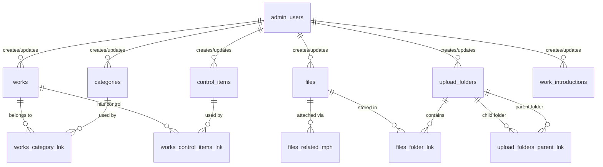

# データベース ER 図 / テーブル仕様書

- **接続先**: Supabase (ap-northeast-1) — `sszpjlziqoogvouruaee`
- **DB バージョン**: PostgreSQL 15.8
- **更新日**: 2026-03-26
- **概念 ER 図**: [database-er-diagram.mmd](./database-er-diagram.mmd)

---

## ER 図（概念図）



---

## テーブル一覧

| #   | テーブル名                                              | 種別         | 説明                                             |
| --- | ------------------------------------------------------- | ------------ | ------------------------------------------------ |
| 1   | [works](#works)                                         | コンテンツ   | 作品情報                                         |
| 2   | [categories](#categories)                               | コンテンツ   | 作品カテゴリ                                     |
| 3   | [control_items](#control_items)                         | コンテンツ   | 3D 操作コントロール項目                          |
| 4   | [work_introductions](#work_introductions)               | コンテンツ   | 作品イントロ情報                                 |
| 5   | [works_category_lnk](#works_category_lnk)               | 中間テーブル | works ↔ categories                               |
| 6   | [works_control_items_lnk](#works_control_items_lnk)     | 中間テーブル | works ↔ control_items                            |
| 7   | [files](#files)                                         | ストレージ   | アップロードファイルのメタデータ                 |
| 8   | [files_related_mph](#files_related_mph)                 | ストレージ   | ファイルとコンテンツの紐付け（ポリモーフィック） |
| 9   | [files_folder_lnk](#files_folder_lnk)                   | ストレージ   | ファイルとフォルダの紐付け                       |
| 10  | [upload_folders](#upload_folders)                       | ストレージ   | Strapi メディアライブラリのフォルダ              |
| 11  | [upload_folders_parent_lnk](#upload_folders_parent_lnk) | ストレージ   | フォルダ階層（自己参照）                         |
| 12  | [admin_users](#admin_users)                             | 管理者       | Strapi 管理者アカウント                          |

### ビュー一覧（Frontend から直接参照）

| ビュー名                                | 説明                                                              |
| --------------------------------------- | ----------------------------------------------------------------- |
| [v_works](#v_works)                     | works + files(main_image) + categories の結合ビュー（一覧取得用） |
| [v_work_detail](#v_work_detail)         | works + files(model) + control_items の結合ビュー（詳細取得用）   |
| [v_work_categories](#v_work_categories) | 公開済み categories のみ抽出                                      |

---

## コンテンツテーブル

### works

作品情報を管理するメインテーブル。Strapi の Content-Type `api::work.work` に対応。

| カラム名                   | 型             | 制約                  | NULL | 説明                                           |
| -------------------------- | -------------- | --------------------- | ---- | ---------------------------------------------- |
| `id`                       | `integer`      | PK                    | NO   | サロゲートキー（AUTO INCREMENT）               |
| `document_id`              | `varchar(255)` |                       | YES  | Strapi v5 ドキュメント ID                      |
| `key`                      | `varchar(255)` |                       | YES  | 作品識別キー。`control_items.key` と対応させる |
| `title`                    | `varchar(255)` |                       | YES  | 作品タイトル                                   |
| `description`              | `text`         |                       | YES  | 作品概要                                       |
| `slug`                     | `varchar(255)` |                       | YES  | URL スラッグ（例: `my-work`）                  |
| `created`                  | `date`         |                       | YES  | 作品制作日（`created_at` とは別管理）          |
| `introduction_title`       | `varchar(255)` |                       | YES  | イントロセクションのタイトル                   |
| `introduction_description` | `text`         |                       | YES  | イントロセクションの本文                       |
| `controls_title`           | `varchar(255)` |                       | YES  | コントロールセクションのタイトル               |
| `controls_description`     | `varchar(255)` |                       | YES  | コントロールセクションの説明文                 |
| `created_at`               | `timestamp`    |                       | YES  | レコード作成日時（Strapi 自動付与）            |
| `updated_at`               | `timestamp`    |                       | YES  | レコード更新日時（Strapi 自動付与）            |
| `published_at`             | `timestamp`    |                       | YES  | 公開日時。**NULL = 下書き状態**                |
| `created_by_id`            | `integer`      | FK → `admin_users.id` | YES  | 作成者                                         |
| `updated_by_id`            | `integer`      | FK → `admin_users.id` | YES  | 最終更新者                                     |
| `locale`                   | `varchar(255)` |                       | YES  | ロケール（i18n 用、未使用時は NULL）           |

---

### categories

作品カテゴリを管理するテーブル。Strapi の Content-Type `api::category.category` に対応。

| カラム名        | 型             | 制約                  | NULL | 説明                                |
| --------------- | -------------- | --------------------- | ---- | ----------------------------------- |
| `id`            | `integer`      | PK                    | NO   | サロゲートキー（AUTO INCREMENT）    |
| `document_id`   | `varchar(255)` |                       | YES  | Strapi v5 ドキュメント ID           |
| `key`           | `varchar(255)` |                       | YES  | カテゴリ識別キー（例: `web`, `3d`） |
| `name`          | `varchar(255)` |                       | YES  | カテゴリ表示名（例: `Web`, `3D`）   |
| `created_at`    | `timestamp`    |                       | YES  | レコード作成日時                    |
| `updated_at`    | `timestamp`    |                       | YES  | レコード更新日時                    |
| `published_at`  | `timestamp`    |                       | YES  | 公開日時。**NULL = 下書き状態**     |
| `created_by_id` | `integer`      | FK → `admin_users.id` | YES  | 作成者                              |
| `updated_by_id` | `integer`      | FK → `admin_users.id` | YES  | 最終更新者                          |
| `locale`        | `varchar(255)` |                       | YES  | ロケール（i18n 用）                 |

---

### control_items

3D 作品の操作コントロール項目。`key` カラムで `works.key` と紐付ける。

| カラム名         | 型             | 制約                  | NULL | 説明                                      |
| ---------------- | -------------- | --------------------- | ---- | ----------------------------------------- |
| `id`             | `integer`      | PK                    | NO   | サロゲートキー（AUTO INCREMENT）          |
| `document_id`    | `varchar(255)` |                       | YES  | Strapi v5 ドキュメント ID                 |
| `key`            | `varchar(255)` |                       | YES  | **紐付く `works.key` と同じ値を設定する** |
| `title`          | `varchar(255)` |                       | YES  | コントロール項目のタイトル                |
| `description`    | `text`         |                       | YES  | コントロールの説明文                      |
| `animation_name` | `varchar(255)` |                       | YES  | 3D モデルのアニメーションクリップ名       |
| `is_loop`        | `boolean`      |                       | YES  | アニメーションをループ再生するか          |
| `created_at`     | `timestamp`    |                       | YES  | レコード作成日時                          |
| `updated_at`     | `timestamp`    |                       | YES  | レコード更新日時                          |
| `published_at`   | `timestamp`    |                       | YES  | 公開日時。**NULL = 下書き状態**           |
| `created_by_id`  | `integer`      | FK → `admin_users.id` | YES  | 作成者                                    |
| `updated_by_id`  | `integer`      | FK → `admin_users.id` | YES  | 最終更新者                                |
| `locale`         | `varchar(255)` |                       | YES  | ロケール（i18n 用）                       |

---

### work_introductions

作品のイントロダクション情報テーブル。

| カラム名        | 型             | 制約                  | NULL | 説明                             |
| --------------- | -------------- | --------------------- | ---- | -------------------------------- |
| `id`            | `integer`      | PK                    | NO   | サロゲートキー（AUTO INCREMENT） |
| `document_id`   | `varchar(255)` |                       | YES  | Strapi v5 ドキュメント ID        |
| `title`         | `varchar(255)` |                       | YES  | イントロタイトル                 |
| `description`   | `varchar(255)` |                       | YES  | イントロ説明文                   |
| `created_at`    | `timestamp`    |                       | YES  | レコード作成日時                 |
| `updated_at`    | `timestamp`    |                       | YES  | レコード更新日時                 |
| `published_at`  | `timestamp`    |                       | YES  | 公開日時。**NULL = 下書き状態**  |
| `created_by_id` | `integer`      | FK → `admin_users.id` | YES  | 作成者                           |
| `updated_by_id` | `integer`      | FK → `admin_users.id` | YES  | 最終更新者                       |
| `locale`        | `varchar(255)` |                       | YES  | ロケール（i18n 用）              |

---

## 中間テーブル

### works_category_lnk

`works` と `categories` の多対多リレーションを管理する中間テーブル。

| カラム名      | 型        | 制約                 | NULL | 説明           |
| ------------- | --------- | -------------------- | ---- | -------------- |
| `id`          | `integer` | PK                   | NO   | サロゲートキー |
| `work_id`     | `integer` | FK → `works.id`      | YES  | 作品 ID        |
| `category_id` | `integer` | FK → `categories.id` | YES  | カテゴリ ID    |

---

### works_control_items_lnk

`works` と `control_items` の多対多リレーションを管理する中間テーブル。

| カラム名           | 型        | 制約                    | NULL | 説明                         |
| ------------------ | --------- | ----------------------- | ---- | ---------------------------- |
| `id`               | `integer` | PK                      | NO   | サロゲートキー               |
| `work_id`          | `integer` | FK → `works.id`         | YES  | 作品 ID                      |
| `control_item_id`  | `integer` | FK → `control_items.id` | YES  | コントロール項目 ID          |
| `control_item_ord` | `float8`  |                         | YES  | 同一作品内での表示順（昇順） |

---

## ストレージテーブル（Strapi Upload Plugin）

### files

Strapi 管理画面からアップロードされたファイルのメタデータを管理するテーブル。
実ファイルはストレージプロバイダー（Supabase Storage 等）に保存され、`url` カラムで参照する。

| カラム名            | 型             | 制約                  | NULL | 説明                                                            |
| ------------------- | -------------- | --------------------- | ---- | --------------------------------------------------------------- |
| `id`                | `integer`      | PK                    | NO   | サロゲートキー                                                  |
| `document_id`       | `varchar(255)` |                       | YES  | Strapi v5 ドキュメント ID                                       |
| `name`              | `varchar(255)` |                       | YES  | ファイル名                                                      |
| `alternative_text`  | `varchar(255)` |                       | YES  | 画像の alt テキスト                                             |
| `caption`           | `varchar(255)` |                       | YES  | キャプション                                                    |
| `width`             | `integer`      |                       | YES  | 画像の幅（px）。画像以外は NULL                                 |
| `height`            | `integer`      |                       | YES  | 画像の高さ（px）。画像以外は NULL                               |
| `formats`           | `jsonb`        |                       | YES  | Strapi が生成したリサイズ済みサムネイル情報                     |
| `hash`              | `varchar(255)` |                       | YES  | ファイルの一意ハッシュ                                          |
| `ext`               | `varchar(255)` |                       | YES  | 拡張子（例: `.png`, `.glb`）                                    |
| `mime`              | `varchar(255)` |                       | YES  | MIME タイプ（例: `image/png`, `model/gltf-binary`）             |
| `size`              | `numeric`      |                       | YES  | ファイルサイズ（KB）                                            |
| `url`               | `varchar(255)` |                       | YES  | **ストレージの公開 URL**（Frontend で直接参照）                 |
| `preview_url`       | `varchar(255)` |                       | YES  | プレビュー URL                                                  |
| `provider`          | `varchar(255)` |                       | YES  | ストレージプロバイダー名（例: `@strapi/provider-upload-local`） |
| `provider_metadata` | `jsonb`        |                       | YES  | プロバイダー固有のメタデータ                                    |
| `folder_path`       | `varchar(255)` |                       | YES  | `upload_folders.path` と対応するパス                            |
| `created_at`        | `timestamp`    |                       | YES  | レコード作成日時                                                |
| `updated_at`        | `timestamp`    |                       | YES  | レコード更新日時                                                |
| `published_at`      | `timestamp`    |                       | YES  | 公開日時                                                        |
| `created_by_id`     | `integer`      | FK → `admin_users.id` | YES  | アップロードした管理者                                          |
| `updated_by_id`     | `integer`      | FK → `admin_users.id` | YES  | 最終更新した管理者                                              |
| `locale`            | `varchar(255)` |                       | YES  | ロケール（i18n 用）                                             |

---

### files_related_mph

ファイルとコンテンツを紐付けるポリモーフィック中間テーブル（Strapi の morphic relation）。

> **ポリモーフィックリレーションについて**  
> `related_type` に Strapi の Content-Type UID を、`related_id` に対象レコードの `id` を格納することで、単一テーブルで複数の Content-Type に対してファイルを紐付ける仕組み。
>
> 例: works の `main_image` フィールド  
> `related_type = 'api::work.work'`, `related_id = works.id`, `field = 'main_image'`

| カラム名       | 型             | 制約            | NULL | 説明                                              |
| -------------- | -------------- | --------------- | ---- | ------------------------------------------------- |
| `id`           | `integer`      | PK              | NO   | サロゲートキー                                    |
| `file_id`      | `integer`      | FK → `files.id` | YES  | ファイル ID                                       |
| `related_id`   | `integer`      |                 | YES  | 紐付け先レコードの ID（ポリモーフィック）         |
| `related_type` | `varchar(255)` |                 | YES  | 紐付け先 Content-Type UID（例: `api::work.work`） |
| `field`        | `varchar(255)` |                 | YES  | 対象フィールド名（`main_image` / `model` 等）     |
| `order`        | `float8`       |                 | YES  | 同一フィールド内での表示順                        |

---

### files_folder_lnk

`files` と `upload_folders` の紐付けテーブル。

| カラム名    | 型        | 制約                     | NULL | 説明                 |
| ----------- | --------- | ------------------------ | ---- | -------------------- |
| `id`        | `integer` | PK                       | NO   | サロゲートキー       |
| `file_id`   | `integer` | FK → `files.id`          | YES  | ファイル ID          |
| `folder_id` | `integer` | FK → `upload_folders.id` | YES  | フォルダ ID          |
| `file_ord`  | `float8`  |                          | YES  | フォルダ内での表示順 |

---

### upload_folders

Strapi メディアライブラリのフォルダ構造を管理するテーブル。

| カラム名        | 型             | 制約                  | NULL | 説明                               |
| --------------- | -------------- | --------------------- | ---- | ---------------------------------- |
| `id`            | `integer`      | PK                    | NO   | サロゲートキー                     |
| `document_id`   | `varchar(255)` |                       | YES  | Strapi v5 ドキュメント ID          |
| `name`          | `varchar(255)` |                       | YES  | フォルダ名                         |
| `path_id`       | `integer`      |                       | YES  | ltree 用の数値パス ID              |
| `path`          | `varchar(255)` |                       | YES  | ルートからの絶対パス（例: `/1/3`） |
| `created_at`    | `timestamp`    |                       | YES  | レコード作成日時                   |
| `updated_at`    | `timestamp`    |                       | YES  | レコード更新日時                   |
| `published_at`  | `timestamp`    |                       | YES  | 公開日時                           |
| `created_by_id` | `integer`      | FK → `admin_users.id` | YES  | 作成者                             |
| `updated_by_id` | `integer`      | FK → `admin_users.id` | YES  | 最終更新者                         |
| `locale`        | `varchar(255)` |                       | YES  | ロケール（i18n 用）                |

---

### upload_folders_parent_lnk

フォルダの親子階層を管理する自己参照テーブル。

| カラム名        | 型        | 制約                     | NULL | 説明                            |
| --------------- | --------- | ------------------------ | ---- | ------------------------------- |
| `id`            | `integer` | PK                       | NO   | サロゲートキー                  |
| `folder_id`     | `integer` | FK → `upload_folders.id` | YES  | **子フォルダ**の ID             |
| `inv_folder_id` | `integer` | FK → `upload_folders.id` | YES  | **親フォルダ**の ID（自己参照） |
| `folder_ord`    | `float8`  |                          | YES  | 兄弟フォルダ間の表示順          |

---

## 管理者テーブル

### admin_users

Strapi 管理画面にアクセスできる管理者アカウントテーブル。
各コンテンツテーブルの `created_by_id` / `updated_by_id` から参照される。

| カラム名        | 型             | 制約                  | NULL | 説明                                    |
| --------------- | -------------- | --------------------- | ---- | --------------------------------------- |
| `id`            | `integer`      | PK                    | NO   | サロゲートキー                          |
| `document_id`   | `varchar(255)` |                       | YES  | Strapi v5 ドキュメント ID               |
| `firstname`     | `varchar(255)` |                       | YES  | 名                                      |
| `lastname`      | `varchar(255)` |                       | YES  | 姓                                      |
| `username`      | `varchar(255)` |                       | YES  | ユーザー名                              |
| `email`         | `varchar(255)` |                       | YES  | メールアドレス（ログイン ID）           |
| `is_active`     | `boolean`      |                       | YES  | アカウント有効フラグ                    |
| `blocked`       | `boolean`      |                       | YES  | ブロックフラグ（`true` でログイン不可） |
| `created_at`    | `timestamp`    |                       | YES  | レコード作成日時                        |
| `updated_at`    | `timestamp`    |                       | YES  | レコード更新日時                        |
| `created_by_id` | `integer`      | FK → `admin_users.id` | YES  | 作成者（自己参照）                      |
| `updated_by_id` | `integer`      | FK → `admin_users.id` | YES  | 最終更新者（自己参照）                  |

---

## ビュー仕様（Views）

> Strapi は使用しない。Frontend（Next.js）から Supabase クライアントで直接参照する。

### v_works

作品一覧取得用ビュー。`published_at IS NOT NULL` の作品のみ返す。

```sql
works
  LEFT JOIN files_related_mph  ON field = 'main_image'
  LEFT JOIN files              -- main_image の URL 取得
  LEFT JOIN works_category_lnk
  LEFT JOIN categories
WHERE works.published_at IS NOT NULL
ORDER BY works.updated_at DESC
```

| カラム名           | 元テーブル               | 説明                      |
| ------------------ | ------------------------ | ------------------------- |
| `id`               | `works`                  | 作品 ID                   |
| `title`            | `works`                  | 作品タイトル              |
| `description`      | `works`                  | 作品概要                  |
| `slug`             | `works`                  | URL スラッグ              |
| `created`          | `works`                  | 作品制作日                |
| `created_at`       | `works`                  | レコード作成日時          |
| `image_url`        | `files.url`              | メイン画像の公開 URL      |
| `alternative_text` | `files.alternative_text` | メイン画像の alt テキスト |
| `category_key`     | `categories.key`         | カテゴリ識別キー          |
| `category_name`    | `categories.name`        | カテゴリ表示名            |

---

### v_work_detail

作品詳細取得用ビュー。3D モデル URL とコントロール項目を JSON 集約して返す。

```sql
works
  LEFT JOIN files_related_mph  ON field = 'model'
  LEFT JOIN files              -- model の URL 取得
  LEFT JOIN works_control_items_lnk
  LEFT JOIN control_items      ON ci.key = works.key
WHERE works.published_at IS NOT NULL
GROUP BY works.id, ..., files.url
ORDER BY works.updated_at DESC
```

| カラム名                   | 元テーブル                | 説明                           |
| -------------------------- | ------------------------- | ------------------------------ |
| `id`                       | `works`                   | 作品 ID                        |
| `key`                      | `works`                   | 作品識別キー                   |
| `title`                    | `works`                   | 作品タイトル                   |
| `description`              | `works`                   | 作品概要                       |
| `slug`                     | `works`                   | URL スラッグ                   |
| `created_at`               | `works`                   | レコード作成日時               |
| `introduction_title`       | `works`                   | イントロタイトル               |
| `introduction_description` | `works`                   | イントロ本文                   |
| `controls_title`           | `works`                   | コントロールセクションタイトル |
| `controls_description`     | `works`                   | コントロールセクション説明文   |
| `model_url`                | `files.url`               | 3D モデルファイルの公開 URL    |
| `controls`                 | `json_agg(control_items)` | コントロール項目の JSON 配列   |

`controls` の JSON 構造:

```json
[
  {
    "title": "string",
    "description": "string",
    "animation_name": "string",
    "is_loop": true
  }
]
```

---

### v_work_categories

公開済みカテゴリのみを返すシンプルなビュー。

```sql
SELECT id, key, name
FROM categories
WHERE published_at IS NOT NULL
ORDER BY id
```

| カラム名 | 説明             |
| -------- | ---------------- |
| `id`     | カテゴリ ID      |
| `key`    | カテゴリ識別キー |
| `name`   | カテゴリ表示名   |
