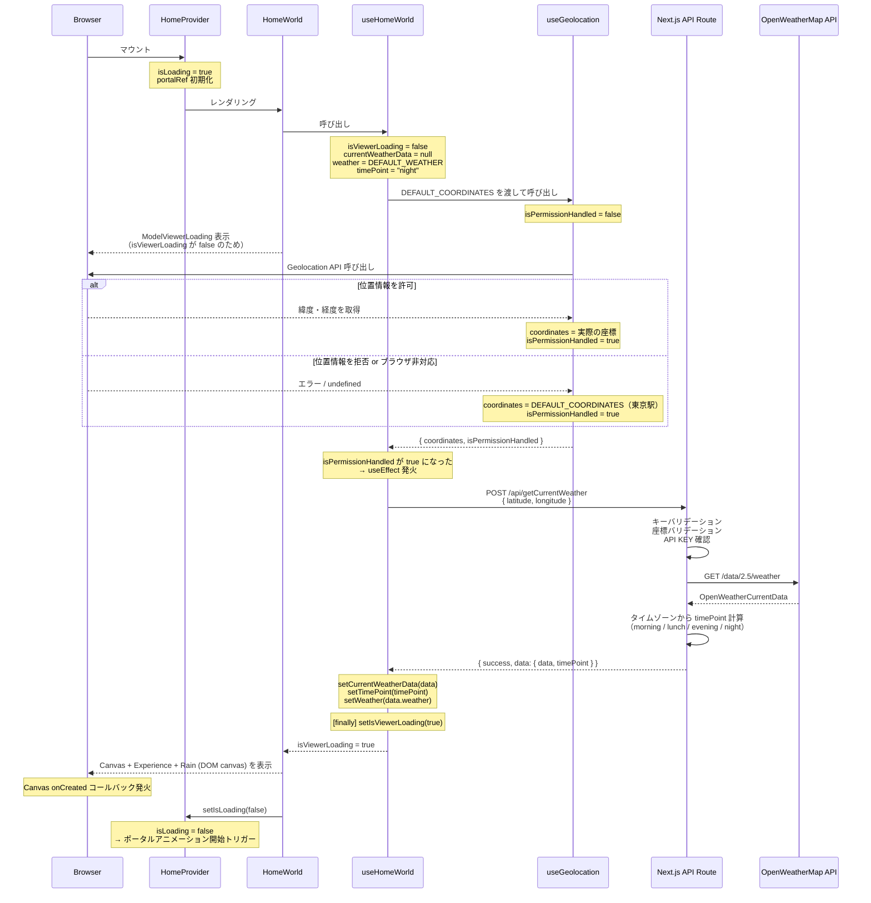
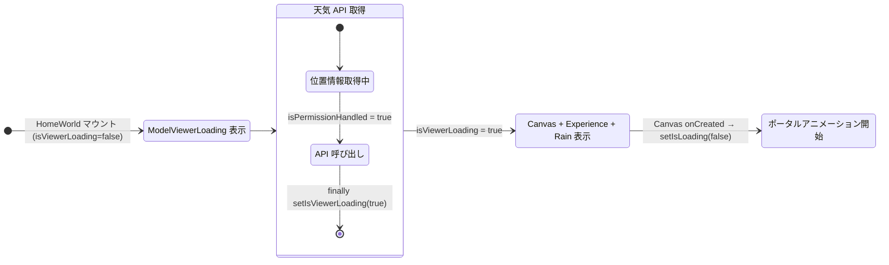
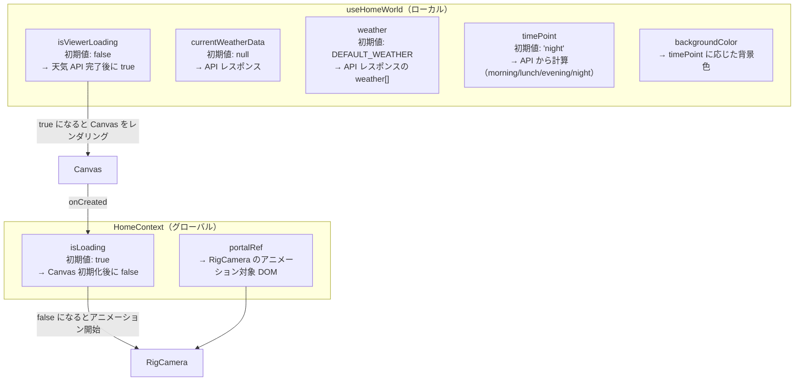
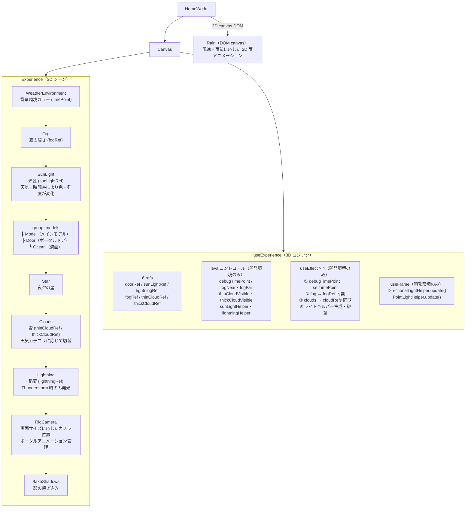
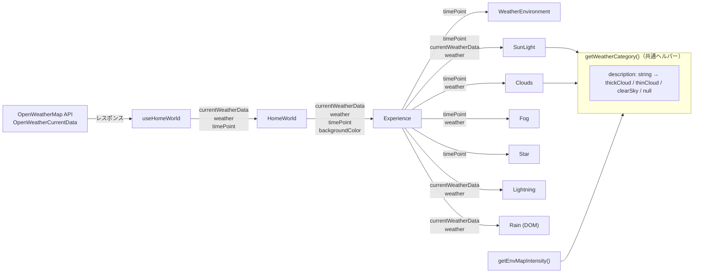
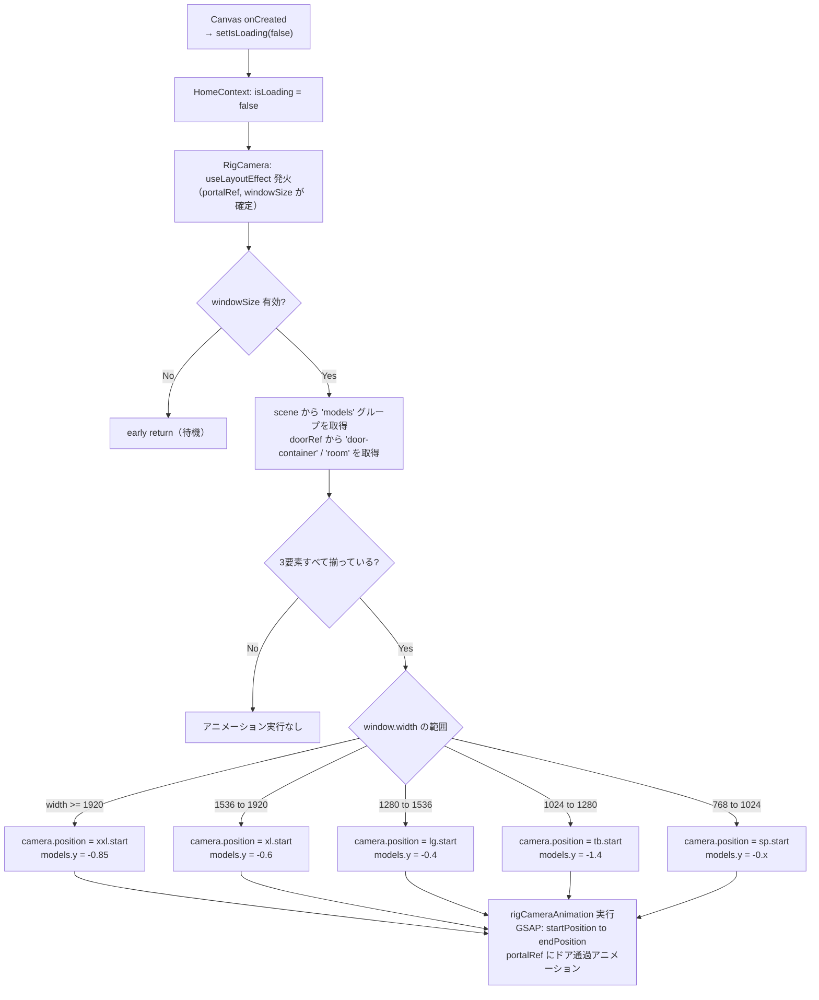

# HomeWorld 処理フロー図

## 1. 全体シーケンス（マウント〜3D シーン表示）



---

## 2. コンポーネント状態管理



---

## 3. 状態変数の二層構造



---

## 4. Experience 内の 3D シーン構成



---

## 5. 天気データの props drilling



---

## 6. RigCamera のポータルアニメーション フロー



---

## 7. 問題点のサマリー（フロー上の課題）

````mermaid
flowchart TB
    subgraph naming["命名の反転"]
        A["isViewerLoading: false → LoadingUI を表示\n（Loading なのに false が ローディング中）"]
        B["isLoading: true → Canvas 未初期化状態\n（Loading が true = まだ読み込んでいない）"]
    end

    subgraph resp["責務分散"]
        C["HomeContext（グローバル）\nポータルアニメーション専用の isLoading を管理"]
        D["useHomeWorld（ローカル）\n天気取得完了の isViewerLoading を管理"]
        E["2つの Loading フラグが異なる層で同時に動いている"]
    end

    subgraph unintuitive["非直感的なフロー"]
        F["Canvas onCreated（3D ライブラリの内部イベント）\n→ Context の setIsLoading を更新"]
        G["レンダリングシステムの内部状態変化が\nReact Context に直接影響する構造"]
    end
```　
　
````
